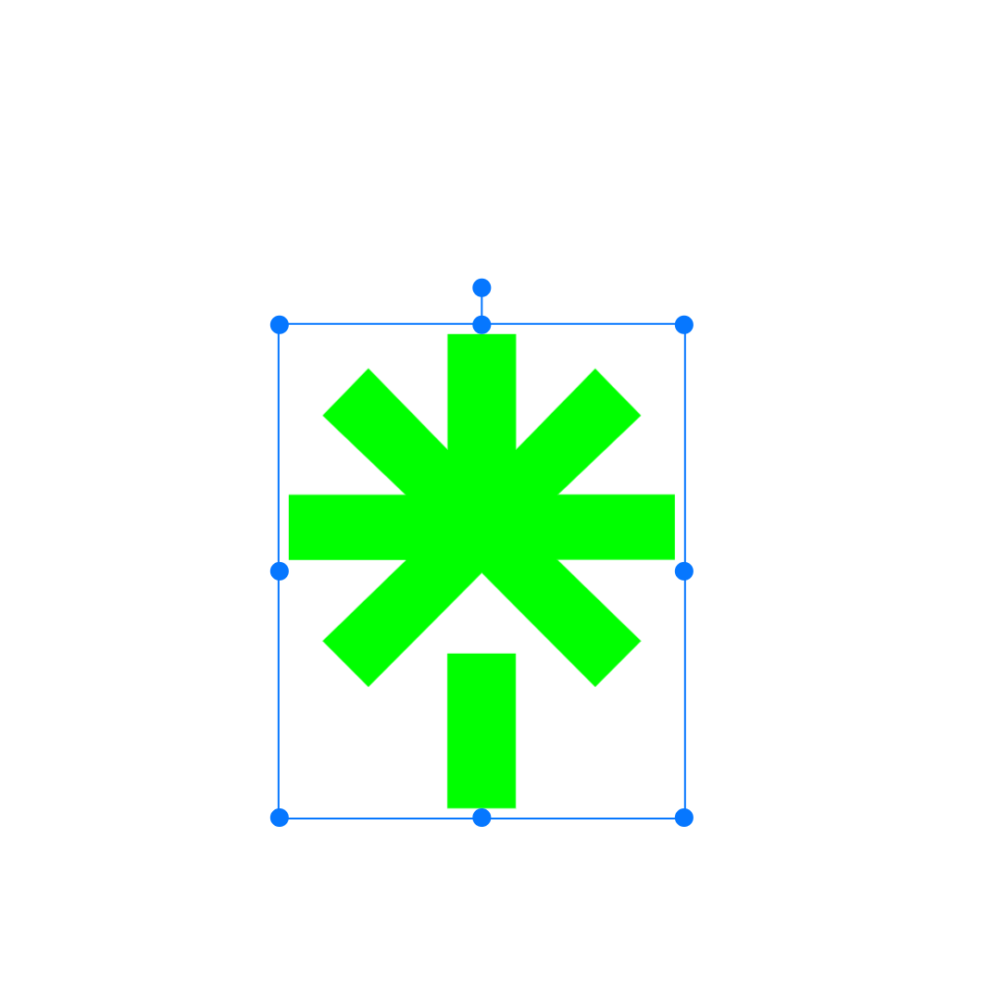

  

<!-- Social icons section -->

  
  &#8287;&#8287;&#8287;&#8287;&#8287;
  
  &#8287;&#8287;&#8287;&#8287;&#8287;
  
  &#8287;&#8287;&#8287;&#8287;&#8287;
  
  &#8287;&#8287;&#8287;&#8287;&#8287;
  

<!-- Social badges section -->

  
  
  
  

<!-- -->

 Hi! I'm Sadham Hussian. A passionate Computer Science student from India. 

<h2>About Me 💬</h2>

- 🔭 I’m a Software Developer with deep internest on **Backend Development** abd working with **Cloud native** applications.

<!-- - 🌱 I’m currently learning **Kubernetes** -->

- 👯 I’m looking to collaborate on **anything interesting**

- ⚡ Fun fact **Jack of all trades , Master of Some!**

 
  
<h2>📘 My Top Projects and Contributions</h2>

  

    
    
    
    
    
    
  

 
  
<h2>🛠️ My Favorite Tools</h2>

  <!-- Some badges are from https://github.com/Ileriayo/markdown-badges -->

  <h3>👨‍💻 Programming and Markup Languages</h3>

  

      
      
      
      
      
      
      
      
      
      
      
  

  <h3>🧰 Frameworks and Libraries</h3>

  

      
      
      
      
      
  

  <h3>🗄️ Databases and Cloud Hosting</h3>

  

      
      
      
      
      
      </a>
      </a>
      </a>
      </a>
      
      
      
  

  <h3>💻 Software and Tools</h3>

  

      
      
      
      
      
      
      
      
      
  

 
  
<h2>📊 Github Stats and Activity</h2>

  <h3>💻 GitHub Profile Stats</h3>

  <!-- https://github.com/anuraghazra/github-readme-stats -->

 

